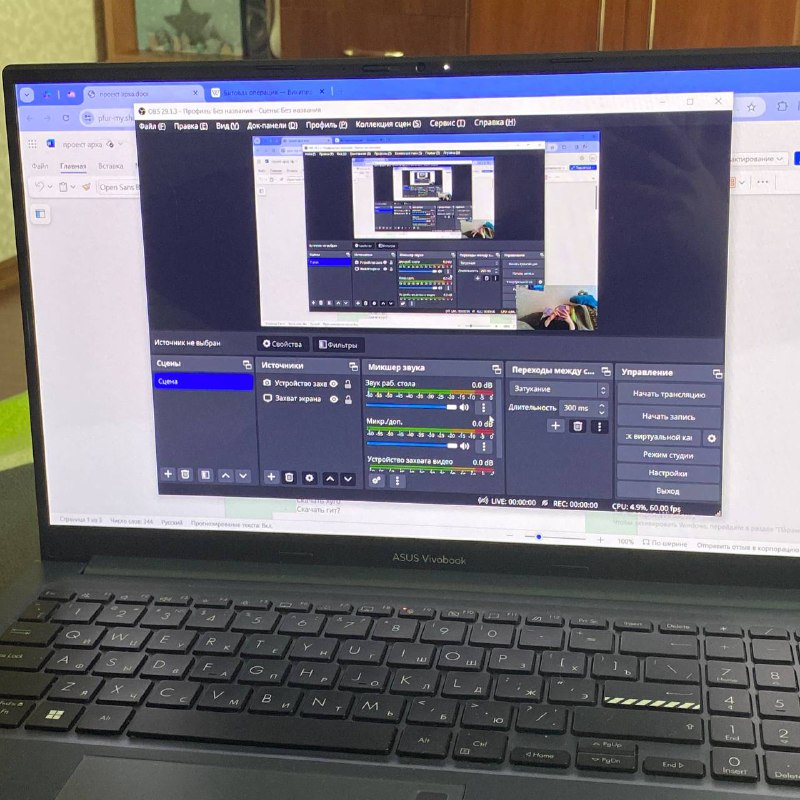
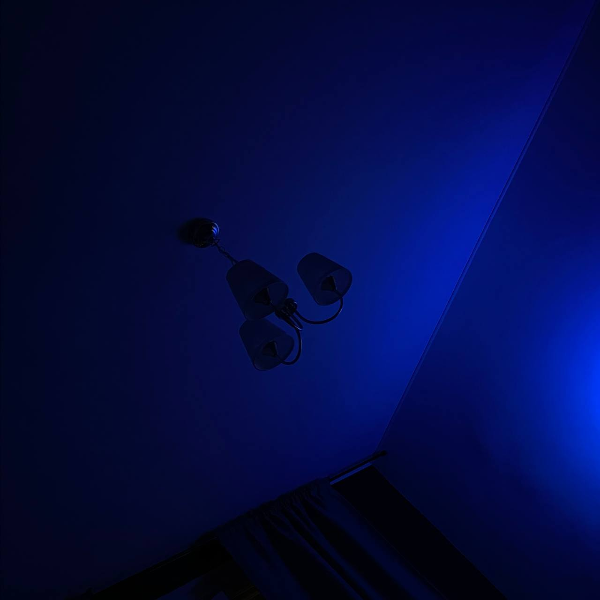

## Понедельник

Этот день для меня относительно ненапряжный. Я обычно нахожусь всё ещё дома, в своём родном городе, куда я езжу каждые выходные. Утром понедельника я встаю рано, чтобы послушать, что нам говорят на дистанционных лекциях, в этот понедельник была лекция по технологии программирования, где нам рассказывали о такой штуке, как , было достаточно интересно. Потом я пила колу и читала мангу, а потом вечером я села в электричку и ехала 2 часа до Москвы, а потом еще около часа на метро до дома. Конечно, такой относительно долгий путь слегка изматывает, но для меня это стоит того. Кстати в этот день мне плохо спалось и приснился кошмар, в котором за мной что-то наблюдало и мне было страшно, но я не могла закричать.

## Вторник

Вот и вторник. День был с кайфом проведен без поездки на физру, мою единственную пару в этот день (помимо дистанционной алгебры в 9 утра). Зато я с кайфом и написала и разобрала код из домашки по технологии программирования. Я сходила подышать свежим воздухом у себя на райончике и потом купила огурчики и чоколадку, чтобы жизнь казалась хоть немного лучше. Пыталась найти в себе силы сделать дз по матану, но так и не вышло (да, я пораздумаю на досуге о том, как и где мне надо стать лучше).

## Среда

Ура, вот и начался почти полноценный учебный день, я пришла к первой паре. В целом день прошел гладенько и я вкусно покушала в столовой. Вечером я делала домашку по ангему.
Сегодня у меня был синий потолок.

## Четверг

Ох четверг четверг(( Трудный день, но если сжать волю или что-то другое в кулак, то можно и все пары выдержать. В этот четверг в моем корпусе должно было быть какое-то шоу талантов, на которое мне хотелось пойти посмотреть на ребят, но я в итоге ушла домой, т.к. не особо хорошо себя чувствовала. А ЕЩЕ НАМ ДЕЛАЛИ ПРИВИВКИ ОТ КОРИ. По пути домой купила вкусный сырочек фету и сиртаки, чтобы делать с ними салатики из огурцов и перцев, всем советую.

## Пятница

В этот день у нас выступление. Я участвую от группы по английскому и по французскому. У те папа у те?

## Суббота

Ура домой, отдыхать и ниче не успевать по дедлайнам. 

## Подвожу итог

Я не монстр продуктивности, но зато живу в свое удовольствие и действую во имя своего комфорта и радости, потому что мне так спокойнее и лучше! Конечно, я сделала несколько полезных вещей, которые помогли мне убедиться в том, что я не совсем бездарность ленивая. Может, однажды я научусь лучше распределять время и подтяну силу воли + дисциплину, но пока что вот так. Главное, вкусно кушайте, пока!

