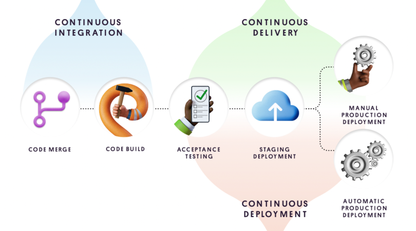

## Что такое непрерывное развертывание? 

Непрерывное развертывание (CD) — это процесс релиза программного обеспечения, в котором используется автоматизированное тестирование. При этом проверяется правильность и стабильность изменений в базе кода для немедленного автономного развертывания в рабочей среде.

Цикл выпуска ПО со временем претерпел изменения. Прежний процесс переноса кода с одной машины на другую и проверки его работоспособности был подвержен ошибкам и требовал много ресурсов. Теперь инструменты могут автоматизировать весь процесс развертывания, что позволяет организациям по разработке сосредоточиться на основных бизнес-потребностях вместо накладных расходов на инфраструктуру.

## Преимущества непрерывного развертывания.

Непрерывное развертывание предлагает потрясающие преимущества в плане производительности для команд, занимающихся разработкой ПО. Используя сочетание DevOps и непрерывного развертывания, команды могут значительно ускорить выпуск релизов. Конвейеры развертывания срабатывают автоматически при каждом внесении изменений, поэтому разработку можно вести быстрее. Если у команды появится идея нового продукта или функции, результат может оказаться у клиентов сразу же после отправки кода. С помощью непрерывного развертывания команды могут оперировать небольшими пакетами изменений. Это позволяет снизить риски, связанные с релизами, и облегчить выпуск исправлений в случае проблем.

С деловой точки зрения непрерывная поставка позволяет компании реагировать на меняющиеся требования рынка, а также быстро развертывать и проверять новые идеи и функции.

## Инструменты для непрерывного развертывания.

### Автоматизированное тестирование.

Наиболее важной зависимостью в контексте непрерывного развертывания выступает автоматизированное тестирование. На деле от этого зависит вся цепочка непрерывной интеграции, поставки и развертывания. Автоматические тесты позволяют избежать регрессии при добавлении нового кода и могут заменить ручную проверку новых изменений.

### Постепенное развертывание.

Непрерывное развертывание отличается от непрерывной поставки наличием автоматического этапа активации нового кода в среде эксплуатации. Конвейер непрерывного развертывания должен предусматривать возможность отмены развертывания в случае возникновения багов или критических изменений. Автоматизированные инструменты постепенного развертывания, такие как сплит-развертывание, являются необходимым требованием для правильного непрерывного развертывания.

### Мониторинг и оповещения.

Надежный конвейер непрерывного развертывания должен включать в себя мониторинг и оповещения в режиме реального времени. Эти инструменты позволяют отслеживать работоспособность всей системы, а также ее состояние до и после развертывания нового кода. Кроме того, с помощью оповещений можно отменить постепенное развертывание, чтобы откатить изменения после неудачной операции.

## Что такое непрерывная интеграция? 

Непрерывная интеграция (CI) направлена на автоматизацию интеграции изменений кода от нескольких участников в единый программный проект. Это основная рекомендация DevOps, позволяющая разработчикам регулярно объединять изменения кода в центральном репозитории, где затем запускаются сборки и тесты. Автоматизированные инструменты используются для проверки нового кода перед интеграцией.

В основе процесса CI лежит система контроля версий исходного кода. Система контроля версий дополняется другими средствами, такими как автоматизированные проверки качества кода, инструменты проверки стиля синтаксиса и многими другими.

## Преимущества непрерывной интеграции.

Непрерывная интеграция — важная часть DevOps и высокоэффективных команд по разработке ПО. При этом преимущества CI приносят пользу не только команде инженеров, но и всем остальным частям организации. CI повышает прозрачность, а также помогает анализировать процесс разработки и поставку ПО. Эти преимущества позволяют другим сотрудникам организации лучше планировать и реализовывать рыночные стратегии. Ниже приведены некоторые из общих преимуществ CI для организации.

### Масштабируемость.

CI позволяет организациям масштабировать команду инженеров, кодовую базу и инфраструктуру. CI помогает создавать рабочие процессы DevOps и Agile, минимизируя бюрократию при интеграции кода и избыточную коммуникацию. Благодаря этому каждый участник команды может внести изменение кода вплоть до выпуска. CI позволяет выполнять масштабирование благодаря удалению организационных зависимостей при разработке отдельных функций. Разработчики могут создавать функции самостоятельно и с полной уверенностью в том, что слияние их кода с остальной частью кодовой базы пройдет без проблем. Это основной процесс DevOps.

### Улучшение цикла обратной связи.

Использование CI имеет полезные побочные эффекты, например быстрая обратная связь по бизнес-решениям. Проектировщики могут быстрее тестировать идеи и подбирать дизайн продукта с помощью оптимизированной платформы CI. Изменения можно быстро продвинуть и оценить. Ошибки и другие проблемы можно оперативно выявить и устранить.

### Улучшение коммуникации.

CI оптимизирует обмен информацией и обеспечивает отслеживаемость среди инженеров, что повышает эффективность сотрудничества между разработчиками и операционным отделом в команде DevOps. Внедряя рабочие процессы с запросами pull и привязкой к CI, разработчики обеспечивают пассивный обмен знаниями. Запросы pull позволяют разработчикам просматривать и комментировать код участников команды. Разработчики теперь могут просматривать функциональные ветки и работать над ними вместе с коллегами по мере продвижения функций по конвейеру CI. Непрерывная интеграция также подходит для управления расходами на ресурсы. Эффективный конвейер CI с автоматизированным покрытием тестами и высокой достоверностью предотвращает регрессии и гарантирует соответствие новых функций спецификации. Перед слиянием новый код должен показать соответствие набору тестовых утверждений CI, обеспечивающих защиту от новых регрессий.

## Инструменты для непрерывной интеграции.

### Управление версиями исходного кода.

Пожалуй, самый важный компонентом непрерывной интеграции — это управление версиями исходного кода. Оно применяется для выявления и разрешения конфликтов редактирования между несколькими разработчиками, использующими общую базу кода. Управление версиями исходного кода поддерживают различные инструменты. Самые известные из них — Git и Subversion. Система контроля версий лежит в основе продуктов, предоставляющих «CI как услугу».

### Автоматизированное тестирование.

Большинство серьезных проектов по разработке ПО включают в себя дополнительную базу кода, не связанную напрямую с бизнес-продуктом и его функциями. Эта вспомогательная база кода представляет собой комплект тестов и действует как набор подтверждений, гарантирующих, что основная база кода работает правильно и без ошибок. Разработчики запускают эти тесты в процессе разработки, чтобы убедиться, что новый код не ухудшает существующие возможности. Для выполнения сценариев тестирования можно использовать и внешние инструменты, чтобы автоматизировать процесс утверждения. Продукты, предоставляющие сервис CI, автоматически запускают сценарии тестирования проекта при возникновении событий, заданных пользователем. Обычно, когда разработчик отправляет код, используя систему контроля версий, это событие запускает автоматическое выполнение полного комплекта тестов.

### Автоматизация сборки.

«Сборки» — это артефакты, которые создаются для получения снимка состояния текущей версии релиза в проекте разработки ПО. Сборки распространяются среди конечных пользователей через различные сети. Обычно для создания артефакта сборки необходимо выполнить ряд шагов сценария в проекте. Инструменты CI помогают оптимизировать процесс сборки с помощью автоматических триггеров в системе контроля версий. Примером триггера может служить слияние нового кода с веткой рабочей среды в базе кода, после чего происходит загрузка сборки на удаленный сервер для скачивания пользователями.

### Автоматические развертывания.

Сборки, готовые к распространению, проходят процесс развертывания. В зависимости от проекта развертывание может приводить к различным результатам. Например, веб-проекты развертываются на общедоступных веб-серверах. Во время такого развертывания артефакт, созданный на этапе сборки, копируется на веб-серверы. Процесс развертывания на мобильных устройствах и настольных компьютерах отличается и может включать в себя загрузку в магазин, откуда пользователи смогут скачать приложение.

## Итоги.

CI/CD является собирательным термином, охватывающим несколько этапов DevOps. CI (непрерывная интеграция) — это способ интеграции изменений кода в репозиторий по несколько раз в день. У CD есть два значения: непрерывная доставка автоматизирует интеграцию в то время, как непрерывное развертывание автоматически выпускает финальную сборку для конечных пользователей. Регулярное тестирование в рамках CI/CD уменьшает количество ошибок и дефектов кода, что делает эту методику незаменимой для рабочего процесса DevOps.

DevOps является культурой и процессом, нацеленным на повышение эффективности разработки программного обеспечения. 

Конвейер CI/CD — это определенная цепочка этапов, связанная с инструментами и средствами автоматизации, на основе которых реализуется жизненный цикл DevOps. Хотя CI/CD и является неотъемлемой частью культуры DevOps, последняя гораздо шире охватывает жизненный цикл разработки программного обеспечения: от сотрудничества межу разработчиками и структуры команд до мониторинга, контроля версий и т. д.

У разных компаний способ внедрения DevOps может сильно отличаться, но по своей сути DevOps невозможно реализовать без CI/CD. Конвейер CI/CD неразрывно связан с культурой DevOps и ее процессами небольших частых выпусков.

##### Источники

#### https://unity.com/ru/solutions/what-ci-cd#continuous-delivery-vs-continuous-deployment
#### https://www.atlassian.com/ru/continuous-delivery/software-testing/continuous-deployment
#### https://www.atlassian.com/ru/continuous-delivery/continuous-integration
